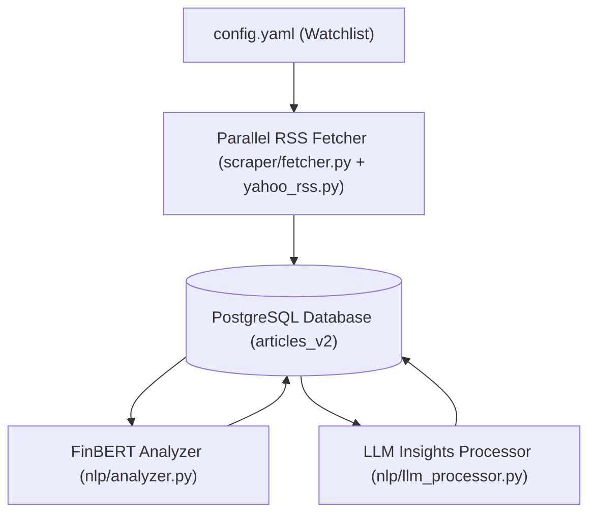

# Stock Intelligence - Article Ingestion Pipeline

The **Article Ingestion Pipeline** is a batch data processing service designed to scrape financial news, persist them in a PostgreSQL database with deduplication, perform sentiment scoring, and enrich articles with LLM-generated bullet summaries and key phrases.

---

## What it does

1. **RSS News Scraping**: Fetches financial news RSS feeds (Yahoo Finance) in parallel (4 worker threads) for a watchlist of stock tickers defined in `config.yaml`.
2. **Database Persistence**: Stores normalized articles in a PostgreSQL database with URL-based conflict avoidance (to prevent duplicate entries).
3. **Sentiment Analysis**: Computes sentiment scores using **FinBERT** (`ProsusAI/finbert`, via `transformers`/`torch`) and tags each article with a label (`Bullish`, `Bearish`, or `Neutral`).
4. **LLM Insights Extraction**: Calls an OpenAI-compatible API to generate a JSON response containing bullet summaries and relevant keywords.

---

## Batch Pipeline Flow



---

## Architecture & Layout

- **Language**: Python 3.13
- **Dependency Manager**: `uv`
- **Data Ingestion**: `feedparser` (+ `beautifulsoup4` for HTML cleanup), scraped concurrently via `ThreadPoolExecutor`
- **Sentiment Scoring**: `transformers` + `torch` (FinBERT — `ProsusAI/finbert`)
- **LLM Integration**: `openai` (compatible SDK)
- **Database Driver**: `psycopg` 3 with a pooled connection (`psycopg_pool.ConnectionPool`)

### Directory Structure

```text
article-ingestion-pipeline/
├── src/
│   ├── core/
│   │   ├── config.py         # Watchlist & RSS configuration loader (config.yaml)
│   │   ├── logger.py         # JSON logging setup (console + rotating file)
│   │   └── settings.py       # Environment variables loader using Pydantic Settings
│   ├── db/
│   │   ├── connection.py     # Pooled PostgreSQL connection (psycopg_pool) + close_pool()
│   │   └── repository.py     # Schema setup and raw SQL query helper functions
│   ├── nlp/
│   │   ├── analyzer.py       # FinBERT sentiment analyzer & database scoring logic
│   │   └── llm_processor.py  # OpenAI-compatible API client for bullet and keyword extraction
│   └── scraper/
│       ├── base.py           # BaseScraper abstract contract for news sources
│       ├── yahoo_rss.py      # YahooRSSScraper implementation (feedparser-based)
│       ├── fetcher.py        # Parallel (ThreadPoolExecutor) scraper orchestration loop
│       └── helpers.py        # HTML tag cleaning utilities
├── config.yaml                # Watchlist (ticker + name) and RSS template
├── .env.example                # Template for required environment variables
├── .devcontainer/
│   └── docker-compose.yaml    # Optional local PostgreSQL instance for development
├── .gitlab-ci.yml              # Scheduled/manual CI pipeline definition
├── main.py                     # Entry point running scraper, sentiment scoring, and LLM enrichment
└── pyproject.toml              # UV packaging & dependencies definition
```

---

## Setup & Running

### Prerequisites

* Python 3.13
* `uv` (Fast Python package installer and manager)
* Access to a PostgreSQL database (e.g. Docker, local, or Neon server)

### 1. Environment Setup

Copy `.env.example` to `.env` and fill in the values:

```bash
cp .env.example .env
```

```env
# Database connection string (required — a local Postgres, Docker, or Neon instance)
DATABASE_URL=postgresql://<user>:<password>@<host>/<database>?sslmode=require

# LLM Provider Configuration
LLM_BASE_URL=https://your-llm-provider.example/v1
LLM_API_KEY=your-api-key
LLM_MODEL=your-model-name
STRICT_LLM_FAILURE=False
```

Need a local Postgres instead of Neon? Spin one up with the provided devcontainer compose file:

```bash
docker compose -f .devcontainer/docker-compose.yaml up -d
```

(Requires `DB_NAME`, `DB_USER`, `DB_PASSWORD`, `DB_PORT` to also be set in `.env` for the compose file itself — then point `DATABASE_URL` at `localhost:$DB_PORT`.)

### 2. Configure the Watchlist

Modify `config.yaml` to specify which tickers should be scraped:

```yaml
scraper:
  watchlist:
    - symbol: "MSFT"
      name: "Microsoft Corporation"
    - symbol: "AMD"
      name: "Advanced Micro Devices, Inc."
    - symbol: "PLTR"
      name: "Palantir Technologies Inc."
  rss_base_url: "https://feeds.finance.yahoo.com/rss/2.0/headline?s={ticker}&region=US&lang=en-US"
  sleep_interval: 1
```

`name` is optional per entry — if omitted, the ticker is still scraped, just without a display name in the database.

### 3. Install Dependencies

Using `uv`, synchronize packages and setup virtual environments:

```bash
uv sync
```

### 4. Execute the Batch Pipeline

To execute the database schema creation, fetch news articles, compute sentiment, and extract LLM insights in a single batch operation, run:

```bash
uv run python main.py
```

---

## Deployment & Scheduling

This pipeline has no long-running server — it's a batch job. It runs two ways:

* **Manual**: `uv run python main.py` locally, or triggered on-demand from the GitLab UI ("Run pipeline").
* **Scheduled (GitLab CI)**: [`.gitlab-ci.yml`](.gitlab-ci.yml) defines a `run-pipeline` job on a `python:3.13-slim` image that installs `uv`, runs `uv sync`, then `uv run python main.py`. It's triggered by a GitLab CI **schedule set to run every 3 hours, Monday–Friday**, and also on pushes to the `production` branch.
* Required CI/CD variables (set in GitLab project settings): `SECRET_DATABASE_URL`, `SECRET_LLM_API_KEY`, `VARS_LLM_BASE_URL`, `VARS_LLM_MODEL`. `STRICT_LLM_FAILURE` is forced to `true` in CI so a fully-failed LLM enrichment pass fails the pipeline visibly.
