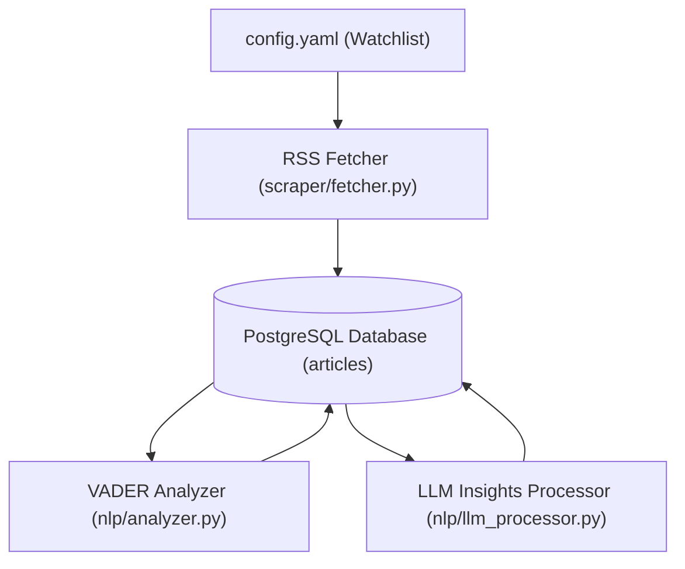

# Stock Intelligence - Article Ingestion Pipeline

The **Article Ingestion Pipeline** is a batch data processing service designed to scrape financial news, persist them in a PostgreSQL database with deduplication, perform sentiment scoring, and enrich articles with LLM-generated bullet summaries and key phrases.

---

## What it does

1. **RSS News Scraping**: Fetches financial news RSS feeds (Yahoo Finance) dynamically for a watchlist of stock tickers defined in `config.yaml`.
2. **Database Persistence**: Stores normalized articles in a PostgreSQL database with URL-based conflict avoidance (to prevent duplicate entries).
3. **Sentiment Analysis**: Computes sentiment scores using **VADER** and tags each article with a label (`Bullish`, `Bearish`, or `Neutral`).
4. **LLM Insights Extraction**: Calls an OpenAI-compatible API to generate a JSON response containing bullet summaries and relevant keywords.

---

## Batch Pipeline Flow



---

## Architecture & Layout

- **Language**: Python 3.13
- **Dependency Manager**: `uv`
- **Data Ingestion**: `feedparser`
- **Sentiment Scoring**: `vaderSentiment`
- **LLM Integration**: `openai` (compatible SDK)

### Directory Structure

```text
article-ingestion-pipeline/
├── core/
│   ├── config.py          # Watchlist & RSS configuration loader (config.yaml)
│   └── settings.py        # Environment variables loader using Pydantic Settings
├── db/
│   ├── connection.py      # PostgreSQL database connection builder
│   └── repository.py      # Database initialization and raw SQL query helper functions
├── nlp/
│   ├── analyzer.py        # VADER Sentiment Analyzer & database scoring logic
│   └── llm_processor.py   # OpenAI-compatible API client for bullet and keyword extraction
├── scraper/
│   ├── fetcher.py         # Feeds parser & scraper loop
│   └── helpers.py         # HTML tag cleaning utilities
├── config.yaml            # Watches list (tickers) and RSS template
├── main.py                # Entry point running scraper, sentiment scoring, and LLM enrichment
└── pyproject.toml         # UV packaging & dependencies definition
```

---

## Setup & Running

### Prerequisites

* Python 3.13
* `uv` (Fast Python package installer and manager)
* Access to a PostgreSQL database (e.g. Docker, local, or Neon server)

### 1. Environment Setup

Create a `.env` file in the `article-ingestion-pipeline` directory with the following variables:

```env
# Database Credentials (use DATABASE_URL or individual variables)
DATABASE_URL=postgresql://<user>:<password>@<host>/<database>?sslmode=require

# Alternatively, set local DB settings:
# DB_HOST=localhost
# DB_PORT=5432
# DB_NAME=stock_db
# DB_USER=postgres
# DB_PASSWORD=yourpassword

# LLM Provider Configuration
LLM_BASE_URL=https://your-llm-provider.example/v1
LLM_API_KEY=your-api-key
LLM_MODEL=your-model-name
STRICT_LLM_FAILURE=False
```

### 2. Configure the Watchlist

Modify `config.yaml` to specify which tickers should be scraped:

```yaml
scraper:
  watchlist:
    - "MSFT"
    - "AMD"
    - "PLTR"
  rss_base_url: "https://feeds.finance.yahoo.com/rss/2.0/headline?s={ticker}&region=US&lang=en-US"
  sleep_interval: 1
```

### 3. Install Dependencies

Using `uv`, synchronize packages and setup virtual environments:

```bash
uv sync
```

### 4. Execute the Batch Pipeline

To execute the database schema creation, fetch news articles, compute sentiment, and extract LLM insights in a single batch operation, run:

```bash
uv run python main.py
```
